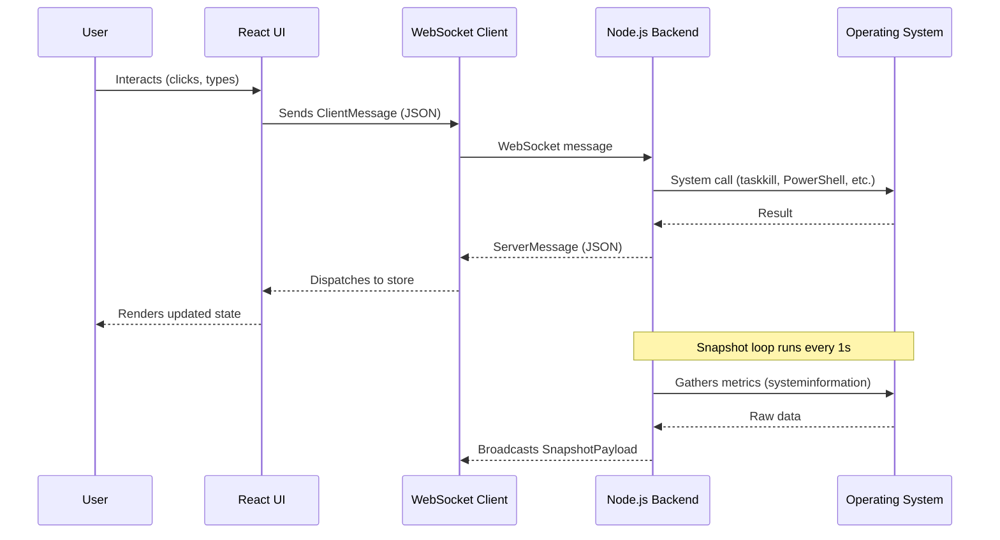

> AI Generated Documentation
>
> This documentation was generated by AI through static analysis of the project's source code. It represents the implementation at the time it was generated and may become outdated as the code evolves. Always treat the source code as the ultimate source of truth.

A desktop system task manager built from scratch with a modern, extensible architecture. It provides real-time process monitoring, system performance visualization, startup and service management, and an extensible plugin system.

---

## Purpose

UltimateTaskManager delivers a cross-platform (Windows-focused) task manager with capabilities similar to Windows Task Manager and htop, but built as a Tauri desktop application. It solves the need for a modern, extensible, real-time system monitoring tool that can:

- Display and control processes with tree hierarchy, sorting, and filtering
- Visualize system performance metrics (CPU, memory, disk, network, GPU) with live charts
- Manage Windows startup entries and services
- Provide system insights (threads, handles, uptime, hardware info)
- Support runtime plugins to extend or modify behavior without modifying core code

It is intended for developers, system administrators, and power users who need detailed process control and system monitoring from a desktop application.

---

## Features

- **Real-time Process Table** — Virtualized table (`react-window`) supporting thousands of processes with columns for Name, PID, CPU, Memory, Disk, Network, GPU, Threads, User
- **Process Tree View** — Expandable parent-child hierarchy with depth indentation
- **Multi-column Sorting** — Click column headers to sort; Shift+click for additive sorting
- **Process Filtering** — Search by name, PID, user, command, port; filter by user and process group (Apps, Background, System)
- **Process Actions** — End Task, Kill Tree, Suspend/Resume, Set Priority (6 levels), Set Affinity (CPU mask)
- **Right-click Context Menu** — On any process row with all actions available
- **Find by Port** — Identify processes listening on a specific port; highlights matching rows
- **Quick Kill** — Terminate processes by port numbers or process names in bulk
- **Force Delete** — Delete locked files with retries, lock-handle probing (via Sysinternals Handle.exe), and attribute clearing
- **Safety Guards** — Protects critical system processes (csrss.exe, lsass.exe, wininit.exe, etc.), system users, and system paths from termination
- **Performance Dashboard** — 1-second (configurable 1–30s) real-time streaming charts for CPU (total + per-core), Memory, Disk I/O, Network I/O, and GPU utilization
- **Floating Chart Windows** — Detach any chart as a draggable, resizable, mini-mode floating window (`react-rnd`); supports multiple simultaneous floating windows
- **System Insights Page** — Displays totals (processes, threads, handles), uptime, CPU model, RAM, GPU list, CPU temperature, listening ports, and an action feed log
- **Startup Management** — Lists Windows Registry startup entries (HKCU/HKLM Run keys); enable/disable entries; impact estimation (low/medium/high)
- **Service Management** — Lists Windows services; Start/Stop/Restart controls with status display
- **Export** — Snapshot data export as JSON; process table export as CSV
- **Theme Toggle** — Dark/Light mode with CSS custom properties
- **Keyboard Shortcuts** — `/` focus search, `r` manual refresh, `Space` pause/resume, `k` kill selected process, `p` performance page, `s` services page
- **Plugin System** — Backend loads `.js`/`.mjs` plugins from a `plugins/` directory; hooks available: `onSnapshot` (modify snapshot payload) and `onClientMessage` (react to WebSocket client messages)
- **Persistent Process History** — Tracks CPU and memory history for each process (up to 180 points per process, 4000 tracked PIDs)
- **Action Feed** — Logs all actions with timestamps on the Insights page
- **Health Endpoint** — HTTP `GET /health` returns `{ status: "ok", time: "..." }`
- **Automatic Reconnection** — WebSocket client retries with exponential backoff (up to 8 seconds)

---

## Tech Stack

| Category            | Technology                                              |
| ------------------- | ------------------------------------------------------- |
| **Language**        | TypeScript (backend + frontend), Rust (Tauri shell)     |
| **Frontend Runtime** | React 18, TypeScript, Vite 5                           |
| **Styling**         | Tailwind CSS 3.4, PostCSS, Autoprefixer, CSS custom properties|
| **State Management**| Zustand 5                                                |
| **Charts**          | Recharts 2.15                                           |
| **Virtualization**  | react-window 1.8 (process table), react-rnd 10.5 (floating windows)|
| **Icons**           | lucide-react 0.511                                      |
| **Backend Runtime** | Node.js, TypeScript, tsx (dev), ws (WebSocket library)  |
| **System Metrics**  | systeminformation 5.27                                  |
| **Process Control** | tree-kill 1.2 (cross-platform process tree termination) |
| **Desktop Shell**   | Tauri 2 (Rust, tauri-build)                             |
| **Build Tool**      | Vite 5, tsc, concurrently                               |
| **Package Manager** | npm (workspaces monorepo)                               |
| **Testing**         | Manual E2E smoke script (PowerShell + Node.js)          |

---

```powershell
cmake -S . -B build -G "Visual Studio 17 2022" -A x64
cmake --build build --config Release
```

<<<<<<< HEAD
Executable output:

- `build/Release/UltimateTaskManager.exe`

## Linked System Libraries

Configured in `CMakeLists.txt`:

- `advapi32`
- `comctl32`
- `d2d1`
- `dxgi`
- `gdi32`
- `iphlpapi`
- `psapi`
- `rstrtmgr`
- `setupapi`
- `cfgmgr32`
- `shell32`
- `shlwapi`
- `user32`
- `ws2_32`

## Manifest / Privileges

- Manifest file: `resources/app.manifest`
- Embedded through: `resources/UltimateTaskManager.rc`
- UAC level: `requireAdministrator`
- Runtime privilege path:
  - Attempt to enable `SeDebugPrivilege`
  - Continue in degraded mode if privilege is unavailable

## Notes on Performance Model

- Non-blocking UI: collection happens on a worker thread
- Snapshot delivery: engine posts updates to UI via `WM_APP` message
- Process list uses owner-data (`LVS_OWNERDATA`) for high row-count scalability

## Next Implementation Milestones

1. Direct2D real-time detachable graph subsystem (with GDI fallback)
2. Network deep-dive tab (TCP/UDP connection mapping and throughput views)
3. Hardware insight tab (USB, storage, adapter, GPU, peripheral details)
4. Advanced tools:
   - Port-based killer
   - Pattern/regex killer
   - Smart Delete++ (Restart Manager)
5. Service manager and startup applications viewer
6. Snapshot export (JSON), process tree view, spike/leak analytics
=======
```
UltimateTaskManager/
├── backend/
│   └── src/
│       ├── index.ts                # Main server: HTTP + WebSocket, message routing
│       ├── types.ts                # All TypeScript interfaces and types
│       ├── utils/
│       │   ├── exec.ts             # Child process execution helpers (PowerShell, command)
│       │   └── safety.ts           # System process protection and group classification
│       └── modules/
│           ├── collectors.ts       # System metrics collection via systeminformation
│           ├── plugins.ts          # Plugin manager: load and execute plugin hooks
│           ├── processActions.ts   # Process control (end, kill tree, suspend, etc.)
│           ├── quickActions.ts     # Quick kill and force delete operations
│           ├── services.ts         # Windows service listing and control
│           └── startup.ts          # Windows startup entry listing and toggling
├── frontend/
│   ├── index.html                  # HTML entry point
│   ├── src/
│   │   ├── main.tsx                # React entry point
│   │   ├── App.tsx                 # Root component: layout, routing, theme
│   │   ├── index.css               # Global styles, Tailwind, CSS custom properties
│   │   ├── vite-env.d.ts           # Vite client type declarations
│   │   ├── store/
│   │   │   └── appStore.ts         # Zustand store: all application state
│   │   ├── lib/
│   │   │   └── wsClient.ts         # WebSocket client with reconnection
│   │   ├── hooks/
│   │   │   ├── useWebSocket.ts     # WebSocket lifecycle and message handler hook
│   │   │   └── useHotkeys.ts       # Keyboard shortcut handler hook
│   │   ├── types/
│   │   │   └── api.ts              # Shared TypeScript types (mirrors backend types)
│   │   ├── utils/
│   │   │   ├── export.ts           # CSV and JSON export utilities
│   │   │   ├── format.ts           # Formatting helpers (bytes, rates, uptime, etc.)
│   │   │   └── processTree.ts      # Process filtering, sorting, tree flattening
│   │   ├── pages/
│   │   │   ├── ProcessesPage.tsx   # Process management page
│   │   │   ├── PerformancePage.tsx # Performance dashboard page
│   │   │   ├── StartupPage.tsx     # Startup entries management page
│   │   │   ├── ServicesPage.tsx    # Service management page
│   │   │   └── InsightsPage.tsx    # System insights and action feed page
│   │   └── components/
│   │       ├── common/
│   │       │   ├── AlertStrip.tsx          # High CPU alert banner
│   │       │   ├── ConnectionBadge.tsx      # WebSocket connection status indicator
│   │       │   └── TopBar.tsx              # Top toolbar: refresh, pause, export, port find, theme
│   │       ├── layout/
│   │       │   └── Sidebar.tsx             # Navigation sidebar with page links
│   │       ├── charts/
│   │       │   ├── MetricChartCard.tsx      # Recharts area chart card
│   │       │   ├── metricData.ts            # Chart data builders and model definitions
│   │       │   ├── FloatingChartsLayer.tsx  # Container for floating chart windows
│   │       │   └── FloatingChartWindow.tsx  # Draggable/resizable floating chart (react-rnd)
│   │       └── processes/
│   │           ├── ProcessesTable.tsx       # Virtualized process table with sorting
│   │           ├── ProcessContextMenu.tsx   # Right-click context menu for processes
│   │           ├── ProcessDetailsPanel.tsx  # Selected process detail + history chart
│   │           └── QuickActionsCard.tsx     # Quick kill and force delete form
│   └── src-tauri/
│       ├── Cargo.toml              # Rust dependencies (Tauri 2)
│       ├── build.rs                # Tauri build script
│       ├── tauri.conf.json         # Tauri app configuration (window, bundle, CSP)
│       └── src/
│           └── main.rs             # Rust entry: spawns backend, manages lifecycle
├── plugins/
│   ├── README.md                   # Plugin documentation
│   └── sample-plugin.mjs           # Example plugin with hook stubs
├── scripts/
│   ├── prepare-desktop-runtime.ps1 # Prepares bundled Node.js runtime for Tauri
│   └── e2e-production-smoke.ps1    # End-to-end smoke test for production build
├── package.json                    # Monorepo root (workspaces)
├── setup.bat                       # One-time setup script (npm install + typecheck)
├── run_app.bat                     # Launch script (web or desktop mode)
└── .gitignore
```

---

## Architecture

### Overall Design

The application follows a client-server architecture split across two processes:

1. **Backend** (Node.js) — Collects system metrics, manages process actions, and communicates via WebSocket
2. **Frontend** (React + Tauri) — Renders the UI, sends commands to the backend, and displays real-time data

The Tauri shell wraps the frontend as a native desktop window and manages the backend child process lifecycle.

### Request/Response Flow



### Data Flow

1. **Snapshot Loop** (backend): Every 1 second, `collectSnapshot()` gathers system metrics using `systeminformation`, normalizes the data, applies plugin hooks (`onSnapshot`), and broadcasts the `SnapshotPayload` to all connected WebSocket clients.
2. **Client Receives**: The `useWebSocket` hook dispatches snapshot data to the Zustand store via `applySnapshot()`. The store maintains a rolling history (180 points per process, 240 performance points).
3. **UI Reacts**: React components subscribe to store slices and re-render on change. The `ProcessesTable` re-computes the `flattenProcessTree` on any filter/sort/expand change.
4. **User Actions**: Actions (process control, service/startup management) are sent as `ClientMessage` objects over WebSocket. The backend processes them and returns `ActionResultMessage` responses, which the store logs in the action feed.

### Authentication Flow

If `TASKMGR_AUTH_TOKEN` is set, the WebSocket server validates incoming connections by checking a `token` query parameter. If the token does not match, the connection is closed with code 1008 ("Unauthorized").

### Plugin System

The `PluginManager` loads plugins from the `plugins/` directory at startup. Each plugin can export an object with optional hooks:

- `onSnapshot(payload)` — Receives the `SnapshotPayload` before broadcasting; can return a modified payload or `void`
- `onClientMessage(message, context)` — Receives every incoming `ClientMessage`; the context provides `broadcast()` and `log()` functions

### Error Handling

- Backend wraps all snapshot collections in try/catch; errors are broadcast as `type: "error"` messages
- Process actions catch errors and return `ActionResultMessage` with `ok: false`
- Frontend WebSocket client logs parse errors and connection failures
- Safety guards prevent operations on critical system processes
- `force_delete` implements retry logic (up to 5 attempts) with backoff

---

## Core Components

### Backend (`backend/src/`)

| Module | Responsibility | Inputs | Outputs | Dependencies |
|---|---|---|---|---|
| `index.ts` | HTTP server, WebSocket server, message routing, session management | Incoming WebSocket messages, HTTP requests | Broadcast `ServerMessage` to clients | `ws`, `collectors`, `plugins`, `processActions`, `quickActions`, `services`, `startup` |
| `types.ts` | All TypeScript type definitions | — | Shared interfaces | None |
| `utils/exec.ts` | Shell command execution | Command + args | `{ stdout, stderr }` | `child_process` |
| `utils/safety.ts` | Process protection and classification | Process metadata (name, user, path, PID) | Boolean (protected) or `ProcessGroup` | — |
| `modules/collectors.ts` | System metrics aggregation | `CollectorContext` (history map) | `BackendSnapshot` with full `SnapshotPayload` | `systeminformation`, `exec`, `safety` |
| `modules/plugins.ts` | Plugin loading and hook execution | Plugin directory path | Modified `SnapshotPayload`; hook notifications | `fs/promises`, dynamic `import()` |
| `modules/processActions.ts` | Process control actions | Action type, PID, priority, affinity | `ActionResultMessage` | `tree-kill`, `exec`, `safety` |
| `modules/quickActions.ts` | Bulk kill, port lookup, force delete | Ports, names, path | `ActionResultMessage` | `systeminformation`, `exec`, `processActions`, `safety` |
| `modules/services.ts` | Windows service listing and control | Service name, action | `ServiceEntry[]` or `ActionResultMessage` | `exec` (PowerShell) |
| `modules/startup.ts` | Windows startup entry listing and toggle | Entry ID, enabled state | `StartupAppEntry[]` or `ActionResultMessage` | `exec` (PowerShell), base64 encoding |

### Frontend (`frontend/src/`)

| Module | Responsibility | Interaction |
|---|---|---|
| `store/appStore.ts` | Central Zustand store holding all application state | Subscribed by all pages and components |
| `lib/wsClient.ts` | Singleton WebSocket client with auto-reconnect | Used by `useWebSocket` hook and action handlers |
| `hooks/useWebSocket.ts` | Connects WebSocket, dispatches messages to store | Sets handlers, sends refresh rate/pause commands |
| `hooks/useHotkeys.ts` | Global keyboard shortcuts | Reads store state, sends WebSocket commands |
| `utils/processTree.ts` | Filters, sorts, and flattens process tree | Consumed by `ProcessesTable` |
| `utils/format.ts` | Value formatting (bytes, rates, percent, uptime) | Used across components |
| `utils/export.ts` | JSON/CSV file download | Called from `TopBar` |
| `components/charts/metricData.ts` | Builds Recharts-compatible data models | Used by `MetricChartCard` and `FloatingChartWindow` |

### Tauri Shell (`frontend/src-tauri/src/main.rs`)

- Spawns the Node.js backend as a child process on app startup
- In debug mode: runs `node backend/dist/index.js` or `npx tsx backend/src/index.ts`
- In release mode: resolves bundled `backend-runtime` from resources or executable directory
- Kills the backend process on app exit
- Uses `CREATE_NO_WINDOW` flag on Windows to hide the backend console window

---

## APIs

### WebSocket API

**Endpoint:** `ws://127.0.0.1:3210/ws`

**Authentication:** Optional — pass `?token=<value>` as query parameter if `TASKMGR_AUTH_TOKEN` is configured.

**Protocol:** All messages are JSON-encoded.

#### Client → Server Messages

| Type | Properties | Description |
|---|---|---|
| `set_refresh_rate` | `seconds: number` (1–30) | Set per-session refresh interval |
| `pause` | none | Pause real-time snapshot delivery |
| `resume` | none | Resume real-time snapshot delivery |
| `manual_refresh` | none | Force an immediate snapshot |
| `process_action` | `action: ProcessActionType`, `pid: number`, optional `priority`, `affinityMask` | Execute process control action |
| `find_by_port` | `port: number` | Find PIDs listening on a port |
| `quick_kill` | optional `ports: number[]`, `names: string[]` | Bulk kill by ports or names |
| `force_delete` | `path: string` | Force delete a file/directory |
| `get_startup` | none | Request startup entries list |
| `set_startup_enabled` | `id: string`, `enabled: boolean` | Enable/disable a startup entry |
| `get_services` | none | Request services list |
| `service_action` | `name: string`, `action: "start" \| "stop" \| "restart"` | Control a Windows service |
| `get_process_history` | `pid: number` | Request CPU/memory history for a PID |

#### Server → Client Messages

| Type | Payload | Description |
|---|---|---|
| `snapshot` | `{ timestamp, performance, processes, ports, insights, alerts }` | Real-time system snapshot (broadcast every interval) |
| `action_result` | `{ action, ok, message, data? }` | Result of a client action |
| `startup_data` | `{ data: StartupAppEntry[] }` | Startup entries list |
| `services_data` | `{ data: ServiceEntry[] }` | Services list |
| `process_history` | `{ pid, data: ProcessHistoryPoint[] }` | History for a specific process |
| `error` | `{ message, details? }` | Error notification |

### HTTP API

| Method | Path | Response |
|---|---|---|
| `GET` | `/health` | `{ status: "ok", time: "<ISO string>" }` |

---

## Environment Variables

| Variable | Default | Description |
|---|---|---|
| `TASKMGR_WS_HOST` | `127.0.0.1` | Backend WebSocket server bind address |
| `TASKMGR_WS_PORT` | `3210` | Backend WebSocket server port |
| `TASKMGR_AUTH_TOKEN` | `""` | Optional authentication token for WebSocket connections |
| `HIGH_CPU_ALERT_THRESHOLD` | `85` | CPU percentage threshold for high CPU alerts |
| `VITE_TASKMGR_WS_URL` | `ws://127.0.0.1:3210/ws` | Frontend WebSocket server URL (passed via Vite) |
| `VITE_TASKMGR_AUTH_TOKEN` | `""` | Frontend authentication token (passed via Vite) |

---

## Database

Not applicable. The application does not use a database. All state is ephemeral (held in memory) — the backend holds process history in a `Map<number, ProcessHistoryPoint[]>` and the frontend holds state in the Zustand store.

---

## Configuration

### `package.json` (root)

Monorepo root with npm workspaces (`backend`, `frontend`). Scripts orchestrate development (`concurrently`), build, typecheck, and Tauri commands.

### `backend/tsconfig.json`

Targets ES2022, NodeNext module resolution, strict mode. Compiles from `src/` to `dist/`.

### `frontend/tsconfig.json`

Targets ES2020 with JSX support, bundler module resolution, strict mode. References `tsconfig.node.json` for build-time config files.

### `frontend/vite.config.ts`

Vite 5 configuration with React plugin. Dev server on `127.0.0.1:5173`. Build config separates vendor chunks (`recharts` → `vendor-charts`, other deps → `vendor-core`).

### `frontend/tailwind.config.ts`

Tailwind CSS 3.4 configuration with dark mode via `data-theme="dark"`, custom animations (`fade-slide`, `pulse-soft`), glow shadow, and extended border radii.

### `frontend/postcss.config.cjs`

PostCSS with Tailwind and Autoprefixer plugins.

### `frontend/src-tauri/tauri.conf.json`

Tauri 2 configuration: window size 1480×920 (min 1100×700), product name "UltimateTaskManager", bundles `backend-runtime` resources. CSP is disabled (`null`).

### `frontend/src-tauri/Cargo.toml`

Rust dependencies: Tauri 2 with `custom-protocol` feature.

### `.gitignore`

Ignores `node_modules`, `dist/`, build outputs, Tauri/Rust artifacts (`target/`, `gen/`, `Cargo.lock`), environment files, and OS-specific files.

---

## Dependencies

### Backend Runtime Dependencies

| Package | Purpose |
|---|---|
| `systeminformation` | Cross-platform system metrics (CPU, memory, disk, network, processes, GPU, temperature) |
| `ws` | WebSocket server implementation |
| `tree-kill` | Cross-platform process tree termination |
| `tsx` (dev) | TypeScript execution for development (watch mode) |

### Frontend Runtime Dependencies

| Package | Purpose |
|---|---|
| `react` / `react-dom` | UI framework |
| `zustand` | State management |
| `recharts` | Performance charts (area, line) |
| `react-window` | Virtualized process table for large datasets |
| `react-rnd` | Draggable/resizable floating chart windows |
| `lucide-react` | Icon library |
| `clsx` | Conditional class name utility |
| `@tauri-apps/api` | Tauri frontend API bindings |

### Frontend Dev Dependencies

| Package | Purpose |
|---|---|
| `vite` | Build tool and dev server |
| `@vitejs/plugin-react` | Vite React plugin |
| `typescript` | TypeScript compiler |
| `tailwindcss` / `postcss` / `autoprefixer` | Styling pipeline |
| `@tauri-apps/cli` | Tauri CLI for desktop builds |

---

## Installation

### Prerequisites

- [Node.js](https://nodejs.org/) LTS (v18+)
- npm (ships with Node.js)
- [Rust](https://rustup.rs/) (only required for Tauri desktop builds)

### Setup

```bash
# Clone the repository
git clone <repository-url>
cd UltimateTaskManager

# Install dependencies (all workspaces)
npm install

# Optional: run typecheck to validate
npm run typecheck
```

Or use the setup script:

```bash
setup.bat
```

---

## Running

### Development Mode (Web)

```bash
# Starts both backend and frontend concurrently
npm run dev
```

The backend runs on `ws://127.0.0.1:3210/ws` and the frontend dev server runs on `http://127.0.0.1:5173`.

### Development Mode (Tauri Desktop)

```bash
npm run tauri:dev
```

### Production Build

```bash
npm run build         # Compiles backend + frontend
npm run tauri:build   # Builds Tauri desktop installer
```

### Individual Commands

```bash
# Backend only
npm run dev -w backend

# Frontend only
npm run dev -w frontend

# TypeCheck
npm run typecheck

# Lint (placeholder — no linter configured)
npm run lint
```

### Production E2E Smoke Test

```bash
scripts/e2e-production-smoke.ps1
```

This builds and runs the production Tauri binary, connects via WebSocket, and validates metrics.

---

## How It Works

1. **Startup**: The user launches the application (Tauri desktop mode or browser mode). The Tauri Rust shell spawns the Node.js backend as a child process, then loads the React frontend in a native webview. In browser mode (`npm run dev`), Vite serves the frontend and the backend runs independently.

2. **Connection**: The frontend WebSocket client (`wsClient.ts`) connects to `ws://127.0.0.1:3210/ws`. On connection, it requests startup entries and services data, and receives the latest system snapshot.

3. **Snapshot Loop**: The backend runs a 1-second interval that calls `collectSnapshot()`. This function:
   - Gathers CPU, memory, disk, network, GPU, temperature, OS info, process list, and network connections via `systeminformation`
   - Normalizes process data (threads, handles) with Windows-specific fallback via PowerShell (`Get-Process`)
   - Builds port-to-PID mappings from listening connections
   - Classifies each process (apps/background/system) and checks protection status
   - Tracks CPU/memory history per process (up to 180 points)
   - Generates high-CPU alerts (configurable threshold)
   - Returns a `BackendSnapshot` with the full `SnapshotPayload`, history, and port mappings

4. **Plugin Processing**: Before broadcasting, the `applySnapshot()` hook chain runs each loaded plugin's `onSnapshot` handler, allowing payload modification.

5. **Broadcast**: The backend iterates all sessions and sends the snapshot to each non-paused client whose refresh interval has elapsed.

6. **Frontend Rendering**: The `useWebSocket` hook receives the snapshot and calls `applySnapshot()` in the Zustand store, which updates the snapshot, appends performance history (up to 240 points), and appends process-specific history (up to 180 points per PID). React components subscribed to store slices re-render.

7. **User Interaction**: When the user clicks "End Task", the frontend sends `{ type: "process_action", action: "endTask", pid: 1234 }` over WebSocket. The backend's `handleClientMessage` routes it to `runProcessAction`, which executes `taskkill.exe /PID 1234 /F` on Windows. The result is sent back as an `action_result` message, the snapshot is refreshed, and the action is logged.

8. **Plugins**: The backend loads `.js`/`.mjs` files from the `plugins/` directory at startup. Each plugin can intercept snapshots before broadcast or react to incoming client messages. The frontend is unaware of plugins.

9. **Teardown**: When the Tauri window closes, the Rust `run()` handler receives the `Exit` event and kills the backend Node.js process.

---

## License

Copyright (c) 2026 Babariya Meet. All rights reserved.

No permission is granted to use, copy, modify, merge, publish, distribute, sublicense, create derivative works from, reference, reverse engineer for replication, or otherwise exploit this project, in whole or in part, for any purpose without prior written permission from the copyright holder.
